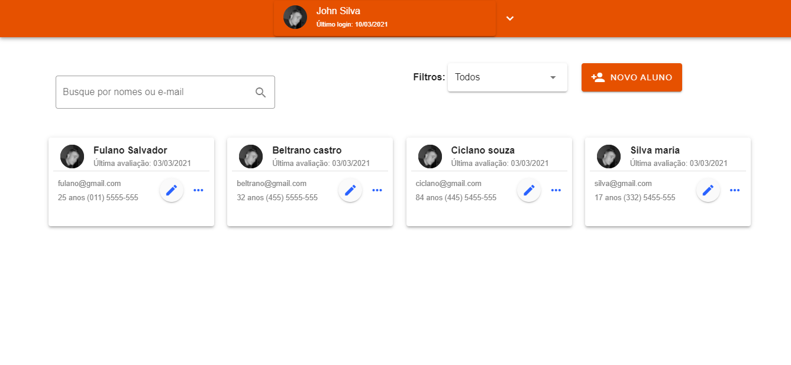
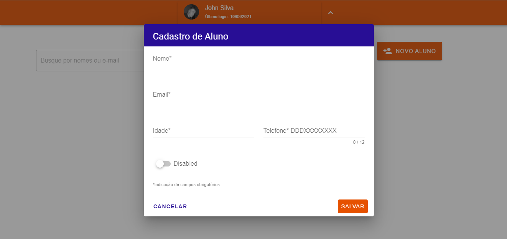
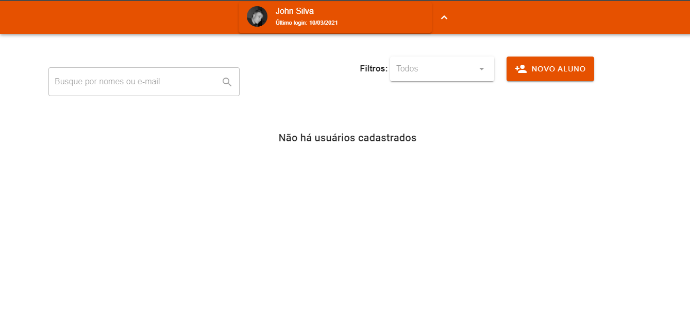

# Roga Labs - Dashboard Test 

<p align="center">
   
</p>


## Description in Portuguese Language
Uma aplicação web desenvolvida com as tecnologias do [VueJs] https://br.vuejs.org/ junto com a biblioteca do [vuetify] https://vuetifyjs.com/en/
Esta app construida no desafio de teste de frontend da [Roga Labs] https://www.rogalabs.com/ . que monstra um modelo de dashboard de cadastro, que contém apenas uma view e um modal-dialog para fazer os cadastros, onde seus dados são persistidos
diretamente no localStorage.

## Demo of Project in Heroku
https://roga-labs-frontend.herokuapp.com/

#### Below are instructions for downloading the project and running on your machine. 

## Project setup
```
yarn install
```

### Compiles and hot-reloads for development
```
yarn serve
```
### Screen create new user 
<p align="center">
   
</p>

### Screen no one user 
<p align="center">
   
</p>


### Customize configuration
See [Configuration Reference](https://cli.vuejs.org/config/).
